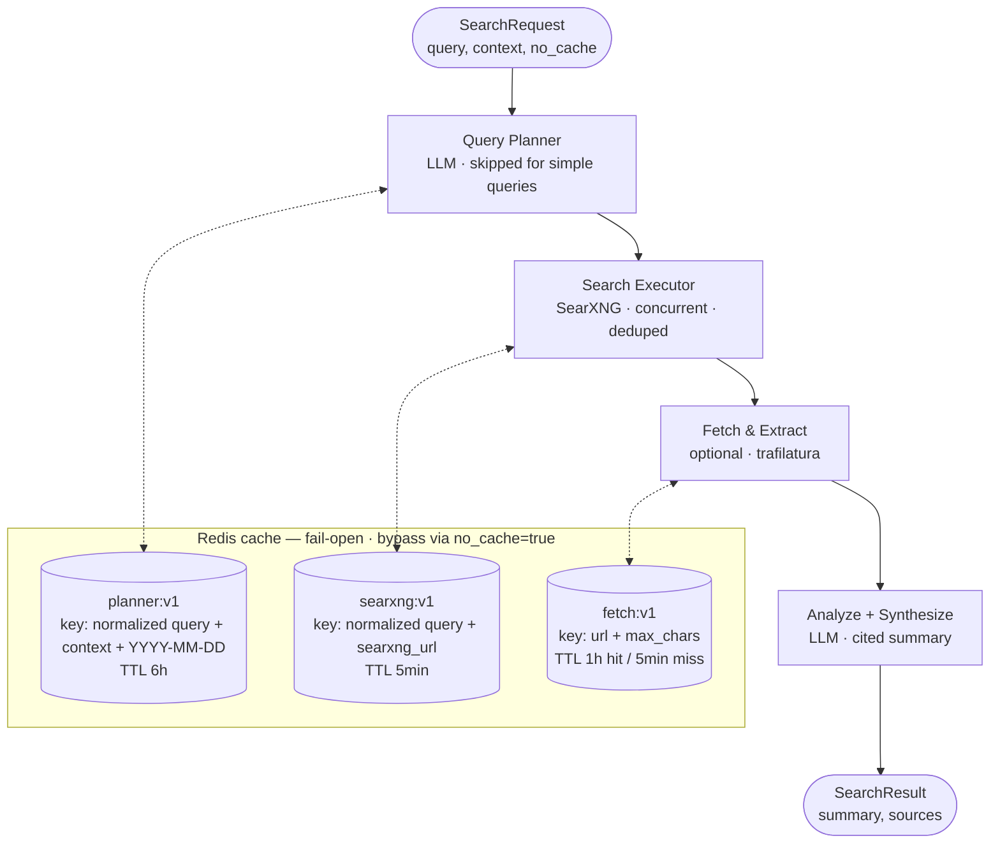

# Search Agent

A FastAPI service that implements a 3-stage web search pipeline using [Pydantic AI](https://ai.pydantic.dev/) agents and a pluggable search backend — [SearXNG](https://docs.searxng.org/) (default) or [Staan Web for AI](https://docs.staan.ai/docs/web-for-ai). Also exposes search as an [MCP](https://modelcontextprotocol.io/) tool for integration with LLM-powered applications (e.g. Open WebUI).

## Architecture



See the [Caching](#caching) section below for fail-open semantics, bypass behaviour, and backend choices.

### Endpoints

| Endpoint | Method | Description |
|---|---|---|
| `/health` | GET | Health check. Pass `?deep=true` to also verify SearXNG connectivity. |
| `/api/v1/search` | POST | Run the full search pipeline. Accepts `{"query": "...", "context": "...", "no_cache": false}`. Set `no_cache: true` to bypass Redis and force a fresh run. |
| `/` | - | MCP Streamable HTTP transport. Exposes `search_web` tool (steps 1+2 only, no LLM synthesis). |

## Prerequisites

- [Docker](https://docs.docker.com/get-docker/) and Docker Compose
- [Task](https://taskfile.dev/) (optional, for convenience commands)
- Access to an OpenAI-compatible LLM endpoint (Ollama, vLLM, OpenAI, etc.)

## Getting Started

1. **Copy the example env file** and fill in your LLM settings:

   ```bash
   cp .env.example .env
   ```

   Required variables:

   | Variable | Description |
   |---|---|
   | `SEARCH_AGENT_LLM_BASE_URL` | OpenAI-compatible API base URL |
   | `SEARCH_AGENT_LLM_API_KEY` | API key for the LLM endpoint |
   | `SEARCH_AGENT_LLM_MODEL` | Model name to use |

2. **Start the services:**

   ```bash
   task up
   ```

   Or without Task:

   ```bash
   docker compose up --detach --remove-orphans
   ```

   This starts:
   - **agent** (the search-agent service) on container port `8001` (random host port unless overridden)
   - **searxng** on container port `8080` (random host port unless overridden)
   - **redis** on container port `6379` (random host port unless overridden) — shared cache for planner output, SearXNG results, and fetched page extracts

3. **Verify it's running:**

   ```bash
   # Find the mapped host port
   docker compose port agent 8001

   # Check health
   curl http://localhost:<port>/health
   ```

## Configuration

All environment variables use the `SEARCH_AGENT_` prefix (via pydantic-settings).

| Variable | Default | Description |
|---|---|---|
| `SEARCH_AGENT_DEBUG` | `false` | Enables DEBUG-level logging across `search_agent` + `pydantic_ai` (full agent prompts, outputs, and the SearXNG engine list per query). Does **not** enable `httpx` DEBUG (which would leak `Authorization` headers). |
| `SEARCH_AGENT_LLM_BASE_URL` | `http://localhost:11434/v1` | OpenAI-compatible LLM endpoint |
| `SEARCH_AGENT_LLM_API_KEY` | `not-needed` | API key for the LLM |
| `SEARCH_AGENT_LLM_MODEL` | `llama3` | Model name |
| `SEARCH_AGENT_LLM_STRICT_TOOLS` | `true` | OpenAI strict tool definitions. Set to `false` for models that don't support it (e.g. Mistral). |
| `SEARCH_AGENT_LLM_TIMEOUT` | `60` | LLM request timeout (seconds) |
| `SEARCH_AGENT_SEARCH_PROVIDER` | `searxng` | Search backend: `searxng` (self-hosted) or `staan` ([Staan Web for AI](https://docs.staan.ai/docs/web-for-ai)) |
| `SEARCH_AGENT_SEARXNG_URL` | `http://searxng:8080` | SearXNG instance URL |
| `SEARCH_AGENT_SEARXNG_TIMEOUT` | `15` | SearXNG request timeout (seconds) |
| `SEARCH_AGENT_STAAN_API_KEY` | *(empty)* | **Required when provider is `staan`** — startup fails without it. Never logged. |
| `SEARCH_AGENT_STAAN_URL` | `https://api.staan.ai` | Staan API base URL |
| `SEARCH_AGENT_STAAN_MARKET` | `en-us` | Market/locale for Staan searches (e.g. `da-dk`) |
| `SEARCH_AGENT_STAAN_TIMEOUT` | `10` | Staan request timeout (seconds); docs recommend 8–10s with enrichment |
| `SEARCH_AGENT_STAAN_ENRICHMENT` | `full_content` | `full_content` (full page body as markdown per result), `extra_snippets` (semantically scored chunks), or `none` (snippets only) |
| `SEARCH_AGENT_STAAN_MAX_SNIPPETS` | `3` | Max chunks per result (`extra_snippets` mode only, 1–10) |
| `SEARCH_AGENT_STAAN_MIN_SCORE` | `0.1` | Min chunk relevance (`extra_snippets` mode only, 0–1) |
| `SEARCH_AGENT_STAAN_CONTENT_MAX_CHARS` | `5000` | Per-result cap on enrichment text mapped into `content` |
| `SEARCH_AGENT_STAAN_CONTENT_MAX_RESULTS` | `5` | Only the top N (reranked) results keep `content`; the rest stay snippet-only. Together with the char cap this keeps the synthesizer prompt inside the LLM context window. |
| `SEARCH_AGENT_SEARCH_PIPELINE_TIMEOUT` | `90` | Overall pipeline timeout (seconds) |
| `SEARCH_AGENT_DATETIME_TIMEZONE` | `UTC` | Timezone for date/time in query planner prompts |
| `SEARCH_AGENT_DATETIME_FORMAT` | `%A, %B %-d, %Y, %H:%M %Z` | Date format string |
| `SEARCH_AGENT_MCP_ALLOWED_HOSTS` | `["search-agent:8001","localhost:8001"]` | Hosts allowed for MCP transport |
| `SEARCH_AGENT_SEARCH_SKIP_PLANNER_FOR_SIMPLE_QUERIES` | `true` | Skip query planner for simple queries |
| `SEARCH_AGENT_SEARCH_MAX_QUERIES` | `3` | Cap on how many queries the planner's output is truncated to |
| `SEARCH_AGENT_SEARCH_MAX_RESULTS` | `15` | Max deduplicated results passed to the synthesizer / returned via MCP |
| `SEARCH_AGENT_SEARCH_SIMPLE_QUERY_MAX_WORDS` | `15` | Word-count threshold for the simple-query heuristic |
| `SEARCH_AGENT_SEARCH_SIMPLE_QUERY_MAX_QUESTIONS` | `1` | Max `?` count before a query is considered multi-part |
| `SEARCH_AGENT_SEARCH_FETCH_PAGE_CONTENT` | `false` | Opt-in: fetch and extract main text from result pages (via trafilatura) so the synthesizer sees a longer `content` field in addition to the SearXNG snippet. MCP path (`search_web`) is snippet-only regardless. |
| `SEARCH_AGENT_SEARCH_FETCH_MAX_PAGES` | `5` | When fetch is enabled, only the top N results are fetched |
| `SEARCH_AGENT_SEARCH_FETCH_TIMEOUT` | `10` | Per-page HTTP timeout (seconds) during fetch |
| `SEARCH_AGENT_SEARCH_FETCH_MAX_CHARS` | `5000` | Truncate extracted page text to this many characters |
| `SEARCH_AGENT_SEARCH_FETCH_MAX_BYTES` | `2000000` | Abort a page fetch if the response exceeds this many bytes |
| `SEARCH_AGENT_SEARCH_QUERY_PLANNER_PROMPT` | *(built-in)* | Override the query planner system prompt |
| `SEARCH_AGENT_SEARCH_ANALYZE_SYNTHESIZE_PROMPT` | *(built-in)* | Override the analyze+synthesize system prompt |
| `SEARCH_AGENT_CACHE_BACKEND` | `redis` | Cache backend: `redis` (production — shared across pods), `memory` (tests/dev only, per-process), or `disabled`. |
| `SEARCH_AGENT_CACHE_REDIS_URL` | `redis://redis:6379/0` | Redis connection URL. Used only when `CACHE_BACKEND=redis`. |
| `SEARCH_AGENT_CACHE_FETCH_TTL` | `3600` | TTL (seconds) for successful page extracts. |
| `SEARCH_AGENT_CACHE_FETCH_NEGATIVE_TTL` | `300` | TTL (seconds) for failed/empty fetches (SSRF block, 4xx, byte-cap, empty extract) so transient failures recover quickly. |
| `SEARCH_AGENT_CACHE_SEARXNG_TTL` | `300` | TTL (seconds) for SearXNG result lists. Short by default because engine rankings shift quickly. |
| `SEARCH_AGENT_CACHE_STAAN_TTL` | `300` | TTL (seconds) for Staan result lists. |
| `SEARCH_AGENT_CACHE_PLANNER_TTL` | `21600` | TTL (seconds) for cached planner outputs. The cache key includes today's date (`YYYY-MM-DD`), so entries roll daily regardless of TTL. |

## Caching

Three pipeline stages are cached in Redis to avoid repeating deterministic work across requests and pods:

| Stage | Cache key | Positive TTL | Negative TTL |
|---|---|---|---|
| Query planner | `planner:v1:sha256(normalized_query + context + YYYY-MM-DD)` | `CACHE_PLANNER_TTL` (6h) | not cached |
| SearXNG search | `searxng:v1:sha256(normalized_query + searxng_url)` | `CACHE_SEARXNG_TTL` (5min) | not cached (empty results allowed to retry) |
| Staan search | `staan:v1:sha256(normalized_query + staan_url + market + enrichment + caps)` | `CACHE_STAAN_TTL` (5min) | not cached (empty results allowed to retry) |
| Page fetch (per URL) | `fetch:v1:sha256(url + max_chars)` | `CACHE_FETCH_TTL` (1h) | `CACHE_FETCH_NEGATIVE_TTL` (5min) |

**Fail-open:** every cache operation is wrapped so that Redis errors or timeouts (300ms socket budget) degrade to a miss and the request continues unaffected. A dead or slow Redis will never break search.

**Bypass:** set `"no_cache": true` on a `/api/v1/search` request to force a fresh run. The flag only affects that request and doesn't clear existing entries.

**Backend choice:** production uses `redis` so state is shared across all pods. `memory` is intentionally limited to tests and local single-pod dev — it fragments per process and defeats the shared-hit-rate goal. `disabled` is useful for debugging freshness issues.

**Namespace versioning:** keys are prefixed with `:v1:` so a change to a cached value's shape (e.g. a new `RawSearchResult` field) can be invalidated by bumping the version in `src/search_agent/cache.py` instead of flushing Redis.

## Development

All Python commands run via Docker Compose -- never directly on the host.

### Task commands (requires running services)

```bash
task up                                  # Start all services (required first)
task test                                # Run tests
task test -- tests/test_pipeline.py      # Run a specific test file
task lint:check                          # Lint (src/ only)
task lint:format                         # Format (src/ only)
task lint                                # Lint + format check
task coding-standards:apply              # Lint fix + format
```

> **Heads-up:** `Taskfile.yml` currently sets `SERVICE: search-agent`, but the docker-compose service is named `agent`. Until that variable is fixed, every task that runs `docker compose exec {{.SERVICE}}` (`task test`, `task lint`, `task format`, etc.) will fail with `service "search-agent" is not running`. Use the direct Docker Compose commands below in the meantime.

### Direct Docker Compose (does not require running services)

```bash
docker compose run --rm --no-deps agent uv run pytest
docker compose run --rm --no-deps agent uv run ruff check src tests
docker compose run --rm --no-deps agent uv run ruff format src tests
```

To run against the running containers (picks up the volume-mounted source):

```bash
docker compose exec agent uv run pytest
docker compose exec agent uv run ruff check src tests
```

### Building the production image

```bash
task build:image                         # Build and push with :latest tag
task build:image TAG=v1.0.0              # Build and push with custom tag
```

Image is pushed to `ghcr.io/aarhusai/search-agent`.

## Docker

The Dockerfile uses multi-stage builds with `dev` and `prod` targets. The build target is controlled by the `ENV` variable (defaults to `dev`).

- **dev** -- includes test/lint tools, source is volume-mounted for live reload
- **prod** -- runtime dependencies only (`uv sync --no-dev`)

Services connect via a `bridge` network (`app`) and an external `frontend` network. SearXNG configuration lives in `.docker/searxng/settings.yml`. Redis data persists under `.docker/data/redis/`; the service runs with a 256MB `maxmemory` cap and `allkeys-lru` eviction so it can't grow unbounded.

## Tech Stack

- Python 3.12+
- [FastAPI](https://fastapi.tiangolo.com/) + [Uvicorn](https://www.uvicorn.org/)
- [Pydantic AI](https://ai.pydantic.dev/) for LLM agents
- [SearXNG](https://docs.searxng.org/) for web search
- [MCP](https://modelcontextprotocol.io/) (Model Context Protocol) for tool integration
- [httpx](https://www.python-httpx.org/) for async HTTP
- [trafilatura](https://trafilatura.readthedocs.io/) for optional main-content extraction from result pages
- [Redis](https://redis.io/) as the shared pipeline cache (via `redis-py`)
- [uv](https://docs.astral.sh/uv/) for package management
- [ruff](https://docs.astral.sh/ruff/) for linting and formatting
- [Task](https://taskfile.dev/) for task running
